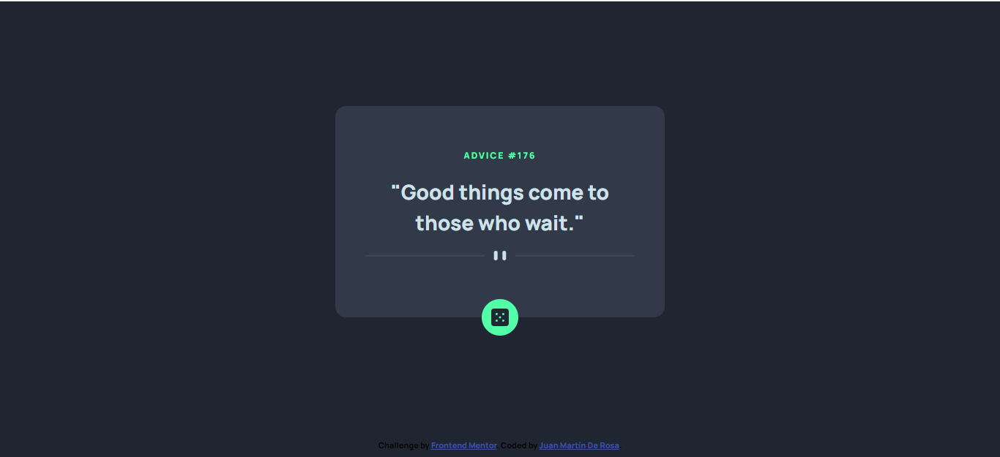

# Frontend Mentor - Advice generator app

## Welcome! 👋

This is a solution to the [Advice generator app challenge on Frontend Mentor](https://www.frontendmentor.io/challenges/advice-generator-app-QdUG-13db). 

[Frontend Mentor](https://www.frontendmentor.io) challenges help you improve your coding skills by building realistic projects.

### Links

- Solution URL: [Add solution URL here](https://github.com/juanmderosa/advicegeneratorapp
- Live Site URL: [Add live site URL here](https://juanmderosa.github.io/advicegeneratorapp/)

## My process

### Built with

- Semantic HTML5 markup
- CSS custom properties
- Flexbox
- Mobile-first workflow
- Fetch & Asyncronus Functions
- API Request